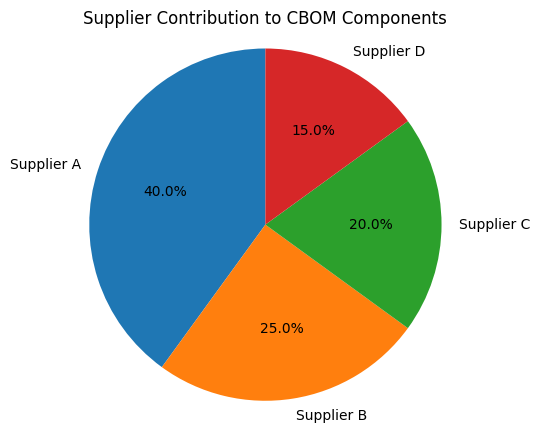

````markdown
# DataFun-04: Exploratory Data Analysis (EDA)

## Project Overview
This repository is dedicated to performing **Exploratory Data Analysis (EDA)** on structured datasets. The goal is to uncover meaningful insights, clean data, visualize distributions, and identify trends that inform decision-making.

## Repository Structure
The project follows a structured workflow to maintain clarity and reproducibility:

```plaintext
datafun-04-eda/
│-- requirements.txt    # Dependencies for the virtual environment
│-- .gitignore  # Files to exclude from Git tracking
|-- kiruthikaa_demo_notebook.ipnyb   #Demo EDA Project      
│-- README.md           # Project documentation
````

## Setup Instructions

To get started, follow these steps:

1. **Clone the repository**

   ```shell
   git clone https://github.com/<your-username>/datafun-04-eda.git
   cd datafun-04-eda
   ```

2. **Create and activate a virtual environment**

   ```shell
   py -m venv .venv
   .\.venv\Scripts\activate   # (Use `source .venv/bin/activate` for Mac/Linux)
   ```

3. **Install dependencies**

   ```shell
   pip install -r requirements.txt
   ```

## Project Workflow

The typical process for working on this project includes:

1. Pulling the latest updates from GitHub.
2. Loading and cleaning datasets.
3. Generating summary statistics and visualizations.
4. Documenting insights and next steps.
5. Pushing changes back to GitHub.

## Exploratory Data Analysis Goals

* Identify missing values and outliers.
* Understand data distributions with histograms and box plots.
* Perform correlation analysis.
* Generate key summary statistics.

## Example Commands

Launch Jupyter notebooks:

```shell
jupyter notebook
```

---

## Notebook Demo: Creating Cells and Visualizing Supplier Data

As part of the initial assignment, we verified our Jupyter environment by creating Markdown and Python cells. Below is a small but meaningful example demonstrating functionality using a **pie chart** related to supplier contributions in a CBOM (Component Bill of Materials) context.

### Sample Code (Python Cell)

```python
import matplotlib.pyplot as plt

suppliers = ['Supplier A', 'Supplier B', 'Supplier C', 'Supplier D']
components = [40, 25, 20, 15]

plt.figure(figsize=(6,6))
plt.pie(components, labels=suppliers, autopct='%1.1f%%', startangle=90)
plt.title('Supplier Contribution to CBOM Components')
plt.axis('equal')
plt.show()
```

### What This Demonstrates

* Basic use of Python and Markdown cells in Jupyter.
* Matplotlib chart rendering in a notebook.
* Relevance to EDA and sourcing trends in supply chain.

---

---

## Output


*This includes a screenshot showing the notebook running in VS Code with the correct `.venv` kernel and successful output of the pie chart visualization.*

## About the project output

This notebook serves as an initial test of the Jupyter environment setup and demonstrates the ability to run Python and Markdown cells successfully. The output shown is a pie chart visualizing supplier contributions to a Component Bill of Materials (CBOM) — a relevant example in supply chain analytics.

The chart helps identify how much each supplier contributes to the total component count, giving stakeholders a quick understanding of sourcing distribution. This kind of simple visualization lays the groundwork for deeper analysis later in the EDA process.
---

```
